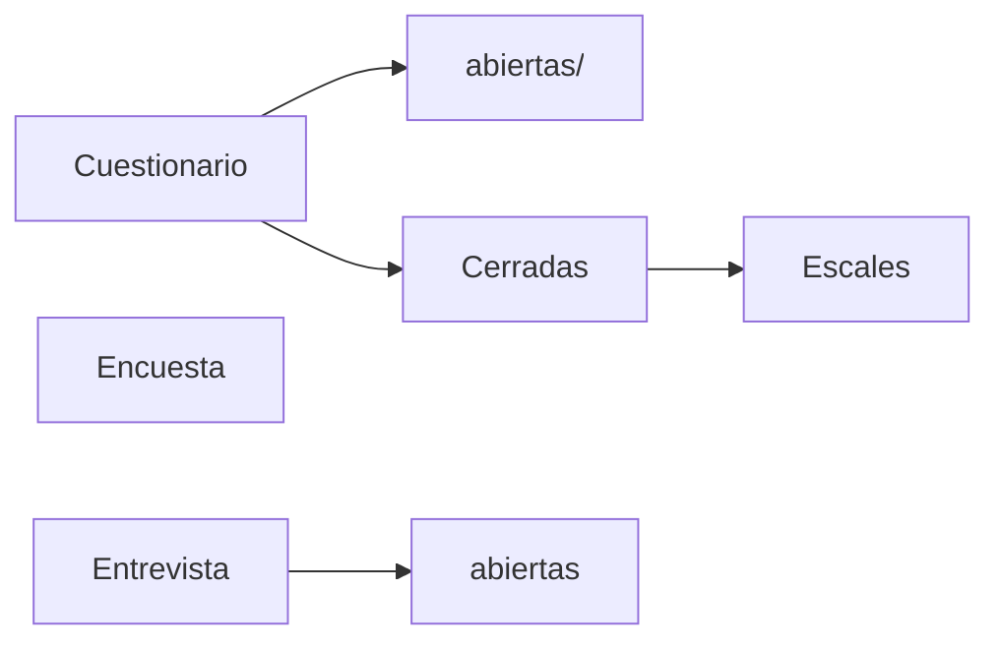

La diferencia es la cantidad de preguntas, la encuesta tiene muchas preguntas y el cuestionario no
Encuesta(mayor a 50 preguntas)

Clase 18/10/22
1. Epistemilía
2. Recolección de datosValidacion de datos
3. Descripción de datos
4. Tipo de investigación
	1. Proyectiva
	2. Descriptiva
5. Interpretación de los datos
6. Elaboración de instrumento
7. Validacion del intrumento
8. Delimitar povlación y muestra
9. Procedimiento
10. Analisis de datos
11. Planteamiento del problema
12. Marco Metodológico
13. Monotecnica
14. Diseño de la investigación
15. Generación de lineamientos
16. Conclusiones y recomendaciones
Obligatorio en un cuestionario:
- sexo
- edad
- sueldo
Formato de encuesta
- Foto
- Objetivo
- preguntas
[[Metodologia de la investigación]]
