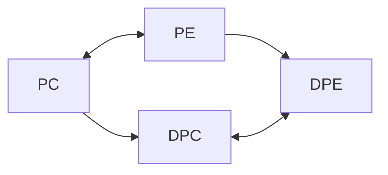

Para cada programa lineal podemos definir otro programa lineal asociado. Este nuevo PL satisface algunas propiedades importantes y además provee de información importante para resolver el primer PL. Distinguiremos dichos PL'S como el programa primal y el programa dual.
Primero formularemos (difiniremos) dicho PL luego desarrollaremos alguas de sus características más importantes, las cuales nos darán como una consecuencia el algoritmo __primal dual__. Finalmente discutiremos el efecto en la variación de los datos iniciales(La matriz A, el vector C y el vector b) 

### Formiación del problema dual.

Asociado con cada programa lineal definiremos a su programa dual, este último puede definirse en su versión canónica oestandar y ambas son equivalentes.
#### Fórma dual canónica
Supongamos un PL en la forma: 
$$P: Minimizar; cx$$
$$
Sujeto \ a; A_{x} \geq b
$$
$$x \geq 0$$
Entonces el programa lineal dual esta definido por: 
$$D: maximizar; \ wb$$
$$Sujeto \ a: WA \leq C\ | \ w \geq 0$$
#### Ejemplo:
$$P: Minimizar; 6_{x1} + 8_{x2}$$
$$Sujeto\ a;\ 3_{x1} + x_{2}\geq 4$$
$$5_{x1}+ 2_{x2} \geq 7$$
$$x_{1},x_{2},\geq 0$$
Elementos dados:
$$b=\begin{pmatrix}4 \\ 7\end{pmatrix},\ C=\begin{pmatrix}6 \\ 8\end{pmatrix},\ A=\begin{bmatrix}3 & 1 \\ 5 & 2\end{bmatrix}$$
$$D\ Maximizar; wb = 4W_{1}+ 7W_{2}$$
$$Sujeto \ a; WA\leq C \iff (w_{1}w_2)$$
$$w_{1}, w_{2}\geq 0$$
$$\begin{bmatrix}3 & 1 \\ 5 & 2 \end{bmatrix} \leq \begin{pmatrix}6 \\ 8 \end{pmatrix} \iff 3w_{1}+5w_{2}\leq 6 \ | w_1+2w_{2}\leq 8\ | w_{1}, w_{2}\geq0$$
Tenemos que b siguen igual la que cambia es A y C, de la siguiente manera:
$$A\begin{bmatrix}3 & 1 & -1 & 0 \\ 5 & 2&0&-1\end{bmatrix},\ C=\begin{pmatrix} 6 \\ 8 \\ 0 \\ 0 \end{pmatrix}$$
Intercambiamos b y c y se quedan igual, procedemos y queda:
$$
Maximizar\ wb = 4w_{1}+ 7w_{2}   
\begin{bmatrix}3 & 1 & -1& 0 \\ 5 & 2 & 0 & -1\end{bmatrix} \leq \begin{pmatrix} 6 \\ 8 \\ 0 \\ 0 \end{pmatrix}
$$
Estos dos problemas son equivalentes, supongamos que con un problema incial en su forma canonica se calcula el dual, el primer problema lo ponemos en su forma no canónica y resolvemos su dual y ambos problemas tienen la misma solución, lmediante parte astracta o mediante métodos conseguimos su resolución.
$\underline{Nota:}$ Los problemas PC y PE son equivalentes y análogamente se tiene que los problemas duales de un mismo problema dual son equivalentes.
pc <--> PE
|               |
|               |
DPC <--> DPE

### Dual del dual
Puesto que el programa dual del un programa lineal es a su vez un programa lineal, podemos preguntarnos acerca del dual de este, concideremos el problema dual en forma canónica
$$Maximiar; wb$$
$$Sujeto\ a;\ wA \leq c\ |\ w\geq $$
Reescribimos
$$Minimizar; C=(-b)\ X= (w)$$
$$Sujeto\ a;\ A=(-A^{t})\ x=(w^{t}) \geq b=(-c^{t})\ |\ w\geq 0 \ $$
Luego:
$$Minimizar = y^{t}\ (-c)^t$$
$$Sujeto\ a;\ y^{t}\ (-A^{t})\leq (-b^{t})\ |\ y^{t}\geq 0$$

#### Lema 1:
El problmea dual del dual es el primal.

### Relaciones primaldual.
Consideramos laforma canónica dual y sean $x>y$ y $w_0$ dos soluciones básicas factibles a los programas dual y primal respectivamente. Entonces $Ax_{0}\geq b, x_{0}\geq0,W_{0}A\leq C\ y\ w_{0}\geq 0$  Multiplicando $Ax_0\geq0$ 
$$minimizar = CX_{0}\geq W_{0}AX_{0}\geq W_{0}\ b = maximizar$$
#### Lemma 2
La función objetivo del problema primal evaluada en cualquier solución factible es mayor que la función objetivo del problema dual evaluada en cualquier solución factible.

#### Corulario 1
Si $X_{0}$ y $W_{0}$ son soluciones factibles del problema primal y el problema dual respectivamente tales que:
$$CX_{0}=W_{0}\ b$$
Entonces $X_{0}$ y $W_{0}$ son soluciones optimas de sus respectivos problemas.
Cualquier solucion factible del problema primal cumple con cualquier solución factible del problema dual entonces:
$$C\overline{X} \geq CX_{0}$$
#### Corulario 2
Si alguno de los problemas resulta tener solucion no acotada entonces el otro problema no posee región factible vacía. Sin embargo, existen casos donde uno de los problemas poseé región facible vacia y el otro problema no posee solución no acotada

## Dualidad y las condiciones de optimalidad de Kuhn-Tucker
Se puede demostrar *(Capitulo5)* que para un programa lineal, condiciones necesarias y suficientes para que x* sea solución óptima, son las siguietes:
1. $Ax^{*} \geq b,\ x^* \geq 0$ 
2. $W^{*}A \leq C,\ W^{*} \geq 0$
3. $W^{*}(AX^{*}-b) = 0,\ C(W^{*}A)X^{*} = 0$
Para algún $W^{*}$ 

#### Lema 3
Si uno de los problemas posee una solución óptima, entonces ambos problemas poseén solución óptima y las evaluaciones de dichas soluciónes óptimas en sus respectivas funciones objetivo coinciden. 

#### Teorema 1
Considerando un programa lineal (primal) y su problema dual, exactamente uno de los siguientes casos se cumple.
1) Ambos programas poseén soluciones óptimas $X^*$ y $W^*$ con $CX^{*} = W^{*}b$
2)  Uno de los problemas posee solución no acotado, con cuyo caso el otro programa posee región factible vacia
3) Ambos problemas poseen factible vacia
En el caso 1), tenemos...
$$\sum_{i=1}^{m}W_{i}(a^ {ix^{*}-b_{i})}= W^{*}(Ax^{*}-b)=0 \rightarrow W^{*}_{i} (a^{i}x^{*}-b_{i})=0,\ i= 1,\dots,m$$
Análogamente
$$(C_{j}-W^{x}a_{j})X^{*}_{j}= 0; j = 1,\dots, n$$
#### Teorema 2
Si $x^{*}$ y $W^{*}$ son cualesquiera puntos óptimos del problema primal y del problema dual, en la forma canónica entonces $$C_{j}-W^{*}a_{j}X^{*}_{j} = 0,\ j=1,\dots,n$$ y
$$W^{*}_{j}(a^{i}X^{*}-b_{i})=0,\ i=1,\dots,m$$
En particular
$$X^{*}_{j}>0 \rightarrow W^{*}a_{j}= C_{j}$$
$$C_{j}> W^{*}a_{j} \rightarrow X^{*}_{j}= 0$$
$$W_{i}^{*} > 0 \rightarrow a^{i}x^{*}=b_{i}$$
$$a^{i}x^{*}>b_{i}\rightarrow w_{i}^{*}= 0$$

#### El problema dual como auxiliar para soluionar problemas primal
Veamos primero un ejemplo que ilustra las ideas pricipales que se utilizan para itulizar el problema dual como apoyo.
$$Minimizar: 2x_{1}+ 3x_{2}+ 5x_{3}+2x_{4}+3x_{5}$$
$$Sujeto\ a: x_{1}+ x_{2}+2x_{3}+x_{4}+3x_{5}\geq 4$$
$$2x_{1}-2x_{2}+3x_{3}+x_{4}+x_{5}\geq3$$
$$x_{1},x_{2}, x_{3}, x_{4}, x_{5}\geq 0$$
El problema dual puede ser resuelto de manera inmediata encontrando gráficamente sus puntos extremos
Maximizar: $4W_{1}+ 3W_{2}$
Sujeto a; $w_{1}+ 2W_{2}\leq 2$
$2W_{1}+ 3W_{2}\leq 5$
$W_{1}+W_{2}\leq 2$
$3W_{1}+ W_{2}\leq 3$
$W_{1},W_{2} \geq 0$

|P minimizar | $4x_{1}+ 3x_{2}+ 5x_{2}+2x_{4}+3x_{5}$|
|---|----|
|Sujeto a; | $x_{1}+x_{2}+2x_{3}+x_{4}+3x_{5}\geq4$
| | $2x_{1}-2x_{2}+3x_{3}+x_{4}+x_{5}\geq3$|
| | $x_{1},x_{2}, x_{3}, x_{4},x_{5} \geq 0$|
Obteniendo la gráfica de las restricciones obtenemos la solución:
![[Pasted image 20221024091209.png]]
R= $\frac{4}{5}$, $\frac{3}{5}$ = $w^{*}$
$w^{*}a_{j}cc_{j}\rightarrow x^{*}_{j}=0,\ w^{*}_{i}>0 \rightarrow a^{i}x^{*}=b_{i}$
$w^{*}a_{j}-c_j<$
Evaluamos:
1. $\frac{4}{5}+ \frac{6}{5}=\frac{10}{5}=2$ La primera no nos dice mucho entonces evaluamos en la segunda restricción
2. $\frac{4}{5}- \frac{6}{5}=- \frac{2}{3} < 3$ por lo que $\rightarrow x_{2}=0=x_{3}=x_{4}$

Podemos inferir que $x_{3}$ $x_{4}$ valen cero por lo que podemos reducir el sistema a 2x2 y quedaria de la siguiente manera, multiplicando la primera por 2 y dividiendo
$$w_{i}^{*}>0 \rightarrow x_{1}+3x_{3}=4$$
$$w_{i}^{*}(a^{i}x^{*}-b_{i})=0 \rightarrow 2x_{1}+x_{5}=3$$
Resolvemos y queda:
$$-5x_{5}= -5$$
$$x_{5}= 1$$
$$x_{1}= 1$$ [[Matematicas avanzadas]]
