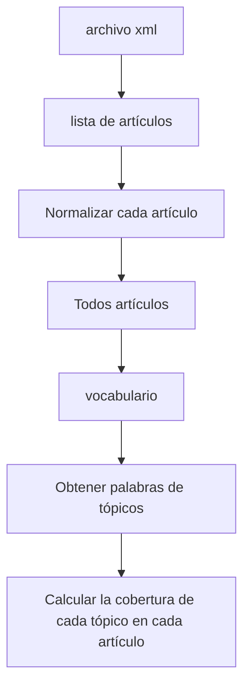
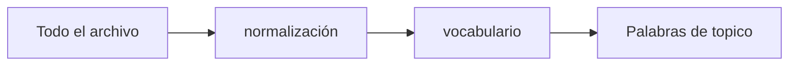
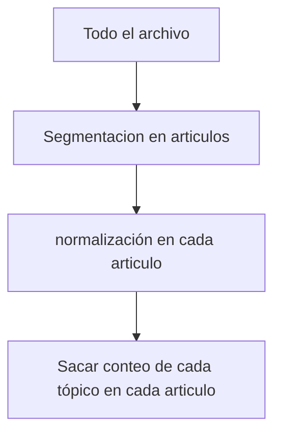

Divegencia de palabras
### Smoothing: Accommodating Zero Count
add-one
Laplasion
$$P(X_{w1} = 1 ) = \frac{count(w1) + 0.5}{N+1}$$

$$P(X_{w2} = 1 ) = \frac{count(w2) + 0.5}{N+1}$$

$$P(X_{w1} = 1, ~X_{w2} =1 ) = \frac{count(w1,w2) + 0.25}{N+1}$$

| | w1| w2|
|-|--|--|
|$1/4$ Pesudoseg_1|0|0|
|$1/4$ Pesudoseg_2|1|0|
|$1/4$ Pesudoseg_3|0|1|
|$1/4$ Pesudoseg_4|1|1|

### Topic Mining and Analysis: Motivation
Para saber que de que habla el autor de tecto
- Task1: Discover k topic
- task2: Figure out which dicuments cover which topics
Podemos tener n documentos, queremos descubir en cuandos documentos se hablan de nuestro topico 

Tarea hacer mineria de ktopicos en ndocumentos

#### Formal DEfinition of Topic Mining and Analysis

- input
	- A **collection** of **N** text documents **C={$d_{1},\dots d_N$}** 
	- Number of topicks: **K**
- Output
	- k topics: **{$\theta_{1},\dots,\theta_{k}$ }** 
	- Coverage of topics in each $d_{i}$: {$\pi_{i1},\dots,\pi_{ik}$ }
	- $\pi_{ij}$ 

#### Initial Idea: Topic = term
$\theta_{1}$= "Sports"
$\theta_{2}$= "Travel"
$\theta_{3}$= "Science"


### Mining k topical terms from collection C
- Parse text in C to obtain candidate terms (e.g., term = word). Desing a scoring function to measure how good each term is as a topic.
	- Favor a representativ term (high frecuency is favored)
	- Avoid words that are too frequent (e.g., "the", "a")
	- TF-IDF weight from retrieval can be very useful.
	- Domain-specific heuristic are possible (e.g favor title words, hashtags )
### Computing topic Coverage: $\pi_ij$

Texto normalizado y lemmatizado

$\theta_{1}$ = "Sports" $\rightarrow~~\pi_{i1}$ count("Sports",$d_{i}$) = 4
$\theta_{2}$ = "Travel" $\rightarrow~~\pi_{i2}$ count("Travel",$d_{i}$) = 2
Con la formula

$$\pi_{ij}=\frac{count(\theta_{j})d_{i}}{\sum_{L=1}^{k}count(\theta_{L}, d_{i})}$$



Por frecuencia de palabras oTDF

Salida:

|articulos/topico| a1| a2| a3| a4|$\dots$ |
|--|--|---|--|--|--|
|w1|   0| 0||
| w2|0.4|0||
|w3|0.1|0.3|0.6|0|
|w4|0.5|0||
|w5|0|0.7||

### How well does this approach work?
Doc $d_{i}$ = "cavaliers vs Golden State Warrior: NBA.."

$\theta_{1}$ "Sport" = $\pi_{il} ~~infty ~~c("sports",d_{i)}= 0 \rightarrow$ Need to count relates words also 

## Probabilistic topic MIning and analysis

- input 
	- A collection of **N** text documents **$C=(d_{1},\dots, d_{N})$
	- Vocabulary set: $V={w_{1},\dots,w_{N}}$ 

Formula 
$$\pi_{ij}=\frac{count(\theta_{j})d_{i}}{\sum_{L=1}^{k}count(\theta_{L}, d_{i})}$$
``` python
for articulo en articulos:
	conteo_p1
	conteo_p2
	.
	.
	.
	conteo_p5
	suma de conteos= ...
	proba_p1 = conteo_p1 / suma de conteos
```
Topicos:
1. Politico
2. México
3. internet
4. justicia
5. Presidente





Input 
- A collection of N text documents c={$d_{1},\dots , d_{N}$}
- vocabulary set: $V={w_{1}, \dots , w_{M}}$
- Number of topics: k
Output
- k topics, each a word distribution: $\theta_{1}, \dots , \theta_{k}$
- Coverag of topics in each $d_{i}$ = 


#### Language Model setup
- Data: document $d=x_{!},x_{2}, \dots , x_{|d|}, x_{i}~~ \in v={w_{1},\dots,w_{M}}$ is a word
- Model: Unigram LM$\theta(=topic):\{\theta =p(w_{i}| \theta)\}$  