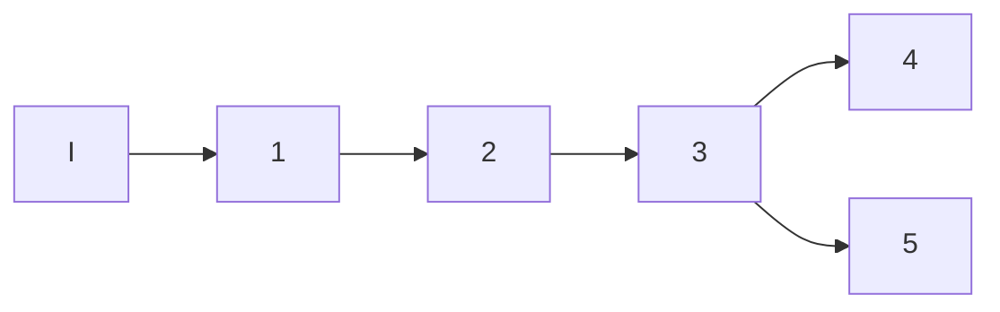

El método de Fibonacci es un método de busqueda lineal para minimizar una función estrictamente cuasiconvexa $\theta$ sobre un intervalo acotado y cerrado.

El método está basado en la sucesión {Fy} de fibonacci, definida como sigue: $F_{y+1}=F_{v}+F_{v-1}~~~y=1,2,\dots$ 
$F_{0} = F_{i}=1$ Supongamos construido $[a_{k},b_{k}]$, entonces definimos:
$$\lambda_{k}=\frac{a_{k}+F_{n-k-1}}{f_{n-k-1}}(b_{k}-a_{n})$$
k = 1,...,n-1 
$$\mu_{k}= a_{k}+ \frac{f_{n-k}}{f_{n-k+1}}(b_{k}-a_{k})$$

Por el teorema 8.1.1 el nuevo intervalo de incertidumbre es $[a_{k-+1},~b_{k+1}]$ el cual 
$$[a_{k+1},b_{k+1}]=\left[ ~ \begin{matrix}[\lambda_{k},b_{k}] &si~\theta(\lambda_{k})>\theta(\mu_{k})\\ [a_{k}, \mu_{k}] & si~\theta(\lambda_{k})\leq \theta(\mu_{k}) \end{matrix}\right.$$
No es dificíl verificar que el intervalo de incertidumbre se reduce en un factor de $F_{n-k}/~F_{n-k+1}$ es decir:
$$b_{k+1}-a_{k+1}=\frac{F_{n-k}}{F_{n-k+1}}(b_{k}-a_{k})$$

Análogamente al método anterior en el paso k+1 se tiene lo siguiente:
$$\lambda_{k+1}=\mu_{n}~o~\mu_{u+1}=\lambda_{k}$$
En este metodo el número de iteraciónes "n" totales que deben de hacerse debe estar fijo desde el inicio del método

##### Resumen del método de busqueda de Fibonacci
Inicialización: Para minimizar una función estrictamente disconvexa en un intervalo $[a_{i},b_{i}]$. Escogemos una longitud final $\ell>0$ y una constante $\epsilon>0$. Sea $[a_{i},b_{i}]$ el intervalo inicial de incertidumbre, escojemos n observaciones tales que:
$$Fn=\frac{b_{i},a_{i}}{\ell}$$
sea
$$\lambda_{i}= a_{i}+ \frac{F_{n-2}}{fn} (b_{i}-ai )~~y~~\mu_{k}=\frac{a_{i}+f_{n+1}}{fn}(b_{i}-a_{i})$$
Evalues principal
$$\theta(\lambda_{i})~y~\theta(\mu_{i}),~~sea~k=1, vaya~al~paso~principal$$

1. Si $\theta(\lambda_{k})>\theta(\mu_k)$, vaya al paso 2; y si $(g(\lambda_{k})\leq \theta(\mu_{k}))$ vaya al paso 3
2. Sea $a_{k+1}=\lambda_{k}$ y $b_{k+1}= b_{k}$. Además, sea $\lambda_{k+1}=\mu_{k}$ y sea $\mu_{k+1}= a_{k+1}+\frac{F_{n-k-1}}{f_{n-k}}(b_{k+1}-a_{k+1})$ Si $k=n-2$ vaya al paso 5, de otra forma , evalue $\theta(\mu_{k+1})$ y vaya al paso 4
3. Sea $a_{n+1}=a_{k}$ y $b_{k+1}=\mu_{k}$. Además sea $\mu_{k+1}= \lambda_{k}$, y sea $\lambda_{k+1}=a_{k+1}+ \frac{f_{n-k-2}}{F_{n-k}}(b_{k+1}-a_{k+1})$. Si k=n-2, vaya al paso 5, de otra forma evalue $\theta(\lambda_{k+1})$ y vaya al paso 4
4. Reemplake k por k + 1 y vaya al paso 1
5. Sea $\lambda_{n}=\lambda_{n-1}+\epsilon$. Si $\theta(\lambda_{n})>\theta(\mu_{n})$ sea $a_n=\lambda_{n}$ y $b_{n}=b_{n-1}$. De otra forma, si $\theta(\lambda_{n})\geq(g(\mu_{n}))$ sea $a_{n}=a_{n-1}$ y $b_{n}=\lambda_{n}$ pare, la solución poptima esta en $[ambos]$

