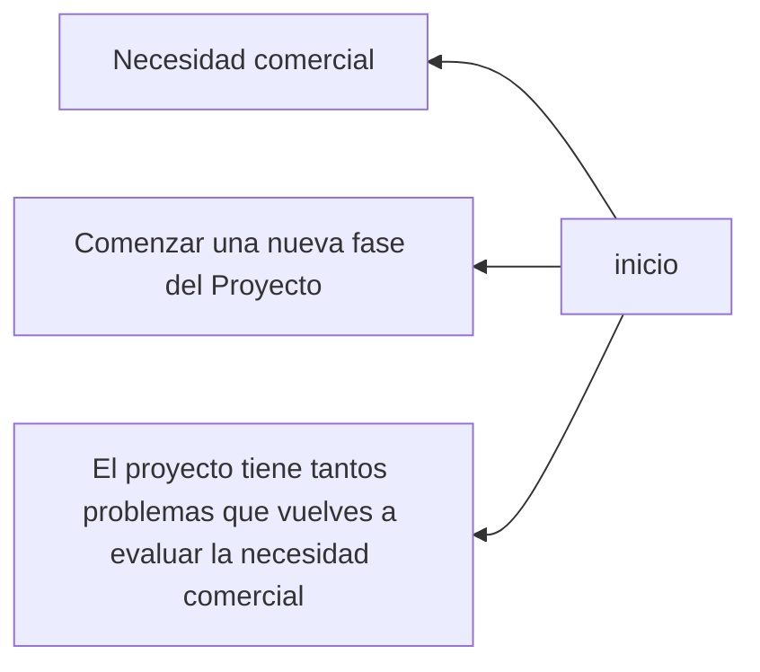
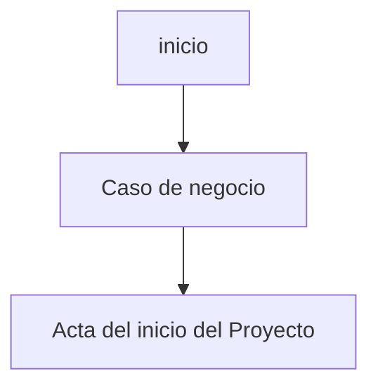

Razones por las que se comienza el proceso de inicio, antes tenemos que hacer unas acciones como:

Viendolo de otra forma tenemos:

A partir del problema nos surgen varias ideas para resolverlo, tenemos que guiarnos de la siguientes elementos:
- Viabilidad
- Rentabilidad
Y después hacer un análisis de Costo-Beneficio y la PMO tiene que ver si es rentabe o viable y ver si autoriza para después asignarle un presupuesto.

Para autorizar se necesita una justificación de la propuesta o justificación técnica, como encargado de la PMO tenemos que ver:
- Si hay algo hecho
- Si es viable
- y planetear métricas

Con todo esto se puede empezar con el caso de negocio.

### Actividades previas recomendadas al inicio de un proyecto
- Seleccionar al Director del Proyecto. (El más apto)
- Identificar la cultura de la compañía. (Establecer un buen ambiente laboral)
- Recolectar los activos de los procesos, que podrían agregar valor al proyecto. (Documentación de procesos)
- Dividir los proyectos grandes en fases. (Dividir todos los proyectos de la misma forma)
	- Inicio
		- HITO (entregable) (para ver un avance)
	- Planeación
	- Ejecución
	- Monitoreo y Control
	- Cierre
- Entender el caso de negocio.

#### Caso de Negocio
Objetivo del Caso de Negocio

- El caso de negocio es la justificación del proyecto que esta realizando el director del proyecto.
- Los directores de proyecto deben saber por qué sus proyectos fueron seleccionados y cómo se ajustan al plan estratégico de la organización. Después necesitan asegurarse de que el proeycto cumpla con esas necesidades.

###### Modelos económicos para la selección de proyectos.

- Valor actual. Valor al día de hoy de futuros flujos de objetivo y puede ser calculado:
	- $PV = FV/(1+R)^{n}$
	- Donde:
		- FV = Valor futuro
		- R = Tasa de interés
		- N = Número de periodos

Ejemplo:
Tienes dos proyectos de donde escoger. El proyecto A tardará tres añós en ser completado y tiene un valor acutal neto de \$45,000. El proyecto B tardará seis años en ser completado y tiene un valor acutal de 

Para hacer un proyecto partimos de indentificar un problema, en pocos parrafos explicar el problema donde el objetivo general va a ser el producto (entregable final)

- Punto uno
	- Explicar el problema
		- En pocos parrafos explicar el probleam donde el objetivo general va ser el producto (entregable final)
	- Descripción de la solución
	- Se puede pensar en otras alternativas (para ver cual de las opciones es más viable)
- Descripcion del proyecto
	- Objetivos
		- Poner objetivos especificos, no muchos solo pocos debido al tiempo
	- Alcance
		- Dentro del alacance, hasta donde se comprometen
		- También incluir elementos fuera del alcance
		- Supuestos, restricciones y dependencias.
			- El supuesto es la planeacion o idealización del proyecto
	- Riesgos e impactos

###### Estudio de Factibilidad

Se tiene que hacer una estudio de factibilidad que incluye
- Operativa (Recurso Humano)
- Tecnológica (HW, SW, Servicios, uso eficiente)
- Económico
- Comercial (publicidad)
# Examen
Martes 26 de Marzo en el laboratorio