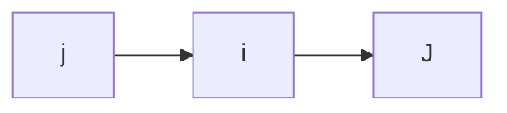

Definición: Un estado $i\in S$ es recurrente si la probabilidad de que regrese a i es uno es decir, si $P(X_{n}= 0~para~n\geq1\mid X_{0}= i)=1$, si $n=0$ $P(X_{0}= i\mid X_{0}=i)=1$ se dice que el estado es absorbente.

Definición: Un estado es transitorio si la probabilidad anterior es estrictamente menor que 1. Esto quiere decir que la cadena puede regresar o no al estado 2.

Definicion: Se dice que el estado j es accesible desde el estado i, si existe un entero $n\geq 0$ tal que $P_{ij}(n)> 0$ esto se escribe $i\rightarrow J$. Si ademas $J\rightarrow i$, i y j son con comunicantes $i \iff J$.

Nota: La comunicación es una relación de equivalencia, es decir se puede particionar el espacio de estados en clases comunicantes.



conjunto como union de clases 

Definición: Una cadena de Markiv es irreducible si y solo si sus estados forman una sola clase comunicante, ejemplo de clase comunicante:
$$\begin{pmatrix}P_{11}&P_{12} \\ P_{21}& P_{22}\end{pmatrix}$$

Definición: Un estado $i \in S$ de una cadena de Markov se llama de absorción si es imposible salir de el. Es decir $P_{ii}= 1$.
Una cadena de markov es absorvente si tiene al menos un estado absorvente y si  de cada estado es posible ir al estado absorbente


## Ejemplo en r
``` r
install.packages("diagram") 
install.packages("expm") 
install.packages("markovchain")

tm.name<- matrix(c(p11.value, p12.value, . . . , pnn.value), nrow=n.value, ncol=n.value, byrow=TRUE)
tr.tm.name<- t(tm.name)

library(diagram) 
plotmat(tr.tm.name, )

library(markovchain) 
dtmc.name<- new("markovchain", transitionMatrix=tm.name, states=c("state1.name", "state2.name",...))
```

