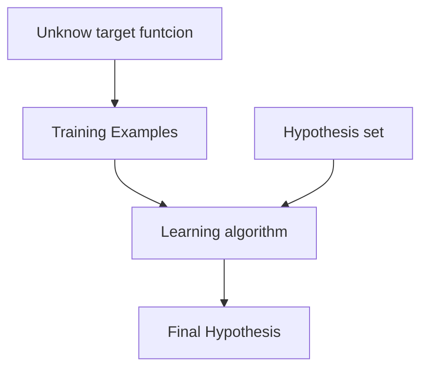
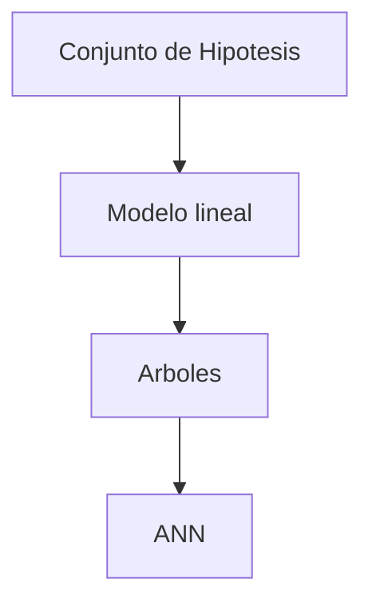
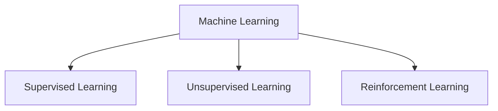

### The learning Problem
Vamos a aprender desde la data. Aprender desde la data es usado en situaciones donde no tenemos una solucion analitica, pero tenemos los datos con la que podemos construir una solución empírica.

### Modelo lineal
Dado un problema especifico, la funcion objetivo y ejemplos de entrenamiento son dictados porel problema. El algoritmo de aprendizaje y el conjunto de hipotesis no son dados. El conjunto de hiportesis y el algoritmo de aprendizaje son referidos como un modelado de aprendizaje informall

Declaremos $x=\mathbb{R}^d$ es un espacio bacio y declaremos $y=\{+1,1\}$ 

La funcion formal $H(x) \in H$ seran escogidos dados diferentes pesos para diferentes coodenadas de x, reflejando la importancia relativa en la decision del credito. Los pesos coordinados son despues combinados para dar forma a una puntacion decredito y resuta comparada con el valor umbral.
- Aprobar credito si $\sum\limits_{i=1}^{d}~w_{i}x_{i}>$threshold
- Denegar credito si $\sum\limits_{i=1}^d~w_{i}x_{i}<$ threshold

### El percepton
Esta formula puede ser escrito para más compresion como:
$$h(x) =sign\left(\left( \sum\limits_{w_{i}}^{d} w_{i}x_{i}\right)+b \right) = sign(w^{T}x)$$

Este modelo H es llamado el perceptron, el nombre lo obtiene en el contexto de inteligencia artificial. La optima seleccion de pesos se defina en la hipotesis final $g\in H$ el algoritmo que produce:
- ¿Qué significa algunos pesos negitivos?
- ¿Que significa que tenga un bia pas largo?
- ¿Quetipo deespacio es generado por el perceptron?

Algoritmo:
1. Inicializar $w(0)$ de forma aleatoria
2. Computar $h(x)$ para cada x en el dataset D.
3. Escojer un eror de clasificacion por ejemplo $(x_{N},y_{N}),\dots(x(t), y(t))$ 
4. Desde el ejemplo est mal clasificado, tenemos $y(t) \neq sign(w^{T}(t) x(y))$, despues actualizamos usando:
$$w(t+1) = w(t) + y(t)x(t)$$

##### Ejercicio
The previous weight update rule has the nice interpretation that ir move in the direction fo classifying x(t) correctly.

1. Show that $y(y) w^{T}(t) x(t) < 0$ (hint: x(t) in missclassified by w(t))
2. Show that $y(t) w^{T}(t+1) x(t)>y(t)w^{T}(t) x(t)$ (Hint: use $w_{i+1}= w_{1}+y_{1}x_{1}$)
3. AS far as classifying $x(t)$ is concerned, argure that the move from $w(t)$ to $w(t+1)$ is a move "in the right direction".

# Libros del curso
Learning from data Mostafa

### Aprendizaje y diseño
- Aprendizaje esta basado en data
- El diseño esta basado en especificaciones

Considere el siguiente problema de reconocer moneda de diferente denominaciones:
- En el aprendizaje vamos a tener un muestreo de las monedas de nuestro dataset
- En el diseño vamos a llamar a la institucion apropiada y preguntas por las especificaciones de las diferentes monedas.

Is a machine learning- based solutionthe best solution?

### Tipos de aprendijaze
- aprendizaje supervizado: aprendizaje desde los datos
- Aprendizaje por refuerzo: aprende de la experiencia.
- Aprendizaje no supervizado: Aprender de los patrones.

