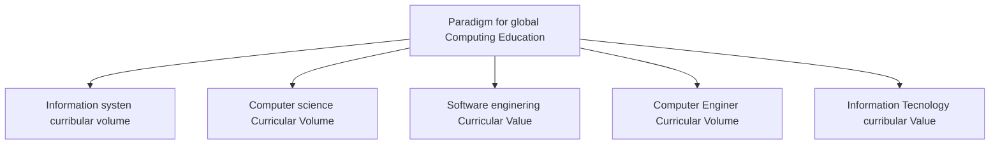

### Desafios de la ciencias de datos
- El manejo de grandes cantidades de datos.
- La calidad de los datos.
- La **privacidad y la seguridad de los datos**
- La interpretación y presentación de los datos.

# Tarea
Contestar las preguntas:
- ¿Con qué cantidades y tipo de datos trabajo un científico de Datos?
- ¿Qué pñataforma se utilizan para almacenar datos estructurados, no estructurados y mixtos?

## Entrega
- Documento PDF hecho en LATEX con portada, indices y bibliografía
- Desarrollo de la investigación contrastando al menos tres fuentes, respuesta a las preguntas y conclusiones propias del autor.
