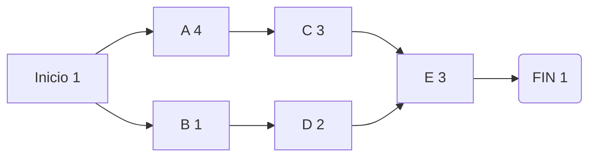

### Diagrama de Red (PDM) Ruta Crítica

La ruta critica es la forma más larga de hacer nuestras tareas, teniendo en cuenta la programación hacia adelante podemos ver el siguiente diagrama:

| Actividad | Tiempo de la Actividad (días) | Predecesor Inmediato |
| --------- | ----------------------------- | -------------------- |
| A         | 4                             | -                    |
| B         | 1                             | -                    |
| C         | 3                             | A                    |
| D         | 2                             | B                    |
| E         | 3                             | C, D                 |
**Nota:** 
- Tiempos tardíos, define ruta crítica (Programación atrás)
Las tareas con holguras no forman parte de la ruta crítica
- Tiempos de inicio, definen holguras (programación hacia delante)

| Tiempo de inicio más próximo | Tiempo de terminación más próximo | Programación hacia delante (suma) |
| ---------------------------- | --------------------------------- | --------------------------------- |
| Tiempo de inicio más leano   | Tiempo de terminación más largo   | Programación hacia atras (restar) |

Métodos para calcular el pert cpm

Pasos:
1. De la tabla, construir el diagrama de red