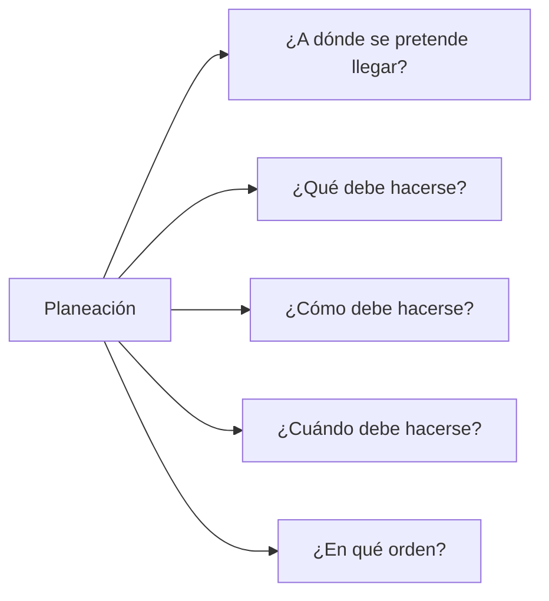
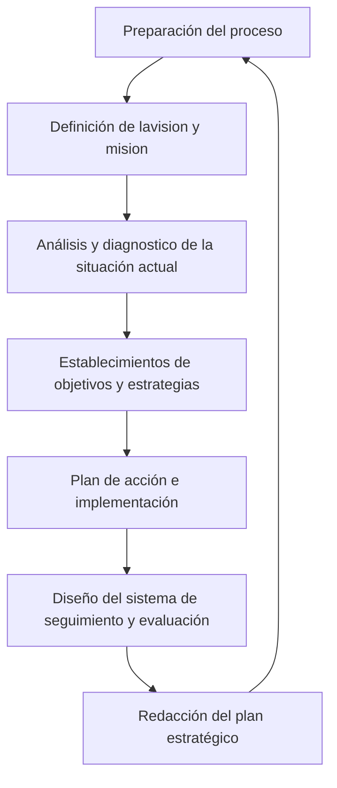

### ¿Qué es la planeación estratégica?

Tratar de bosquejar que se tiene que hacer para obtener ese objetivo, planificar para la meta

#### ¿Qué es la planeación estratégica?

Se trata de una herramienta clave de gestión, que consiste en estudiar, definir y ejecutar el camino que debe seguir una empresa para llegar a sus objetivos estratégicos.

Son metas a largo plazo que determinan la planificación operativa de una empresa durante su vida. Se puede decir que son la brújula para dirigir las actividades de una compañía hacia el cumplimiento de sus propósitos.

Cuáles son los pasos para la planeación estratégica

1. Establecer los objetivos
2. Análisis de la información
3. Definición de estrategias: publicidad o darse a conocer
4. Implementación de las estrategias
5. Evaluación y control

#### Diagnóstico actual
Una de las herramientas más utilizadas para realizar el análisis interno-externo de la empresa es la matriz FODA

#### Identidad organizacional
La identidad organizacional está basada en tres pilares clave: misión, visión, valores.

#### Análisis del entorno
Supone tomar nota de las diferentes tendencias y situaciones que de una forma u otra pueden incidir en el desarrollo de la empresa, es importante considerar otros elementos de interés como clientes, competidores y relación con proveedores.

#### Objetivos estratégicos
Cuando hablamos de objetivos, nos referimos a identificar los resultados concretos que la empresa espera conseguir para asegurar su crecimiento y sostenibilidad en el tiempo.

#### Plan de acción u operativo
Está conformado por el conjunto de estrategias que se realizarán para alcanzar los objetivos propuestos. Debe incluir las tareas previstas, los responsables, los recursos disponibles y los diferentes procedimientos.

No solo existir si no avanzar hacia el futuro gracias a la estrategia, para todo se requiere un plan a partir de las estrategias.
Se puede visualizar dentro del plan quien va a ejecutar, dentro del manual de funciones. Formalizar tareas para crear las cosas de manera organizada y llegar a la meta en común.

#### Seguimiento
Después de que el plan de acción se encuentre en marcha, es indispensable hacer un seguimiento constante de su ejecución.

**De esta forma, podrán detectarse situaciones que requieren una intervención inmediata o la necesidad de ajustes más profundos en las estrategias implementadas hasta este momento.**

Si no funcionan las estrategias hay que cambiarlas ya que puede mermar el resultado o ahorrarse el resultado

### Etapas de un proceso de planificación estratégica

La comunicación es importante para transmitir parte del liderazgo y el como nos desenvolvemos con las distintas personas.

Podemos tener como cultura organizacional que la gente llega a cierta hora y a que hora se ponen a realizar sus actividades.

### Definición de la estrategia: misión, visión y objetivos de la organización
Verificar si cumplen la misión y la visión de la organización elegida.

La misión y la visión son principios mediante los cuales una empresa u organización plantea los objetivos que desea alcanzar a mediano y largo plazo. Ambas describen la identidad y la base teórica de una organización, empresa o marca.

Ambas poseen características que las distinguen por lo que no deben ser confundidas, pero deben formularse conjuntamente ya que es importante que sean coherentes entre sí y que prevean las situaciones que pueden 

La misión es una tarea que se confiere a alguien o grupo de personas para realizar la o ejecutarla y la misma pueden tener diferentes fines como:

# **Preguntas para escribir misión y visión**