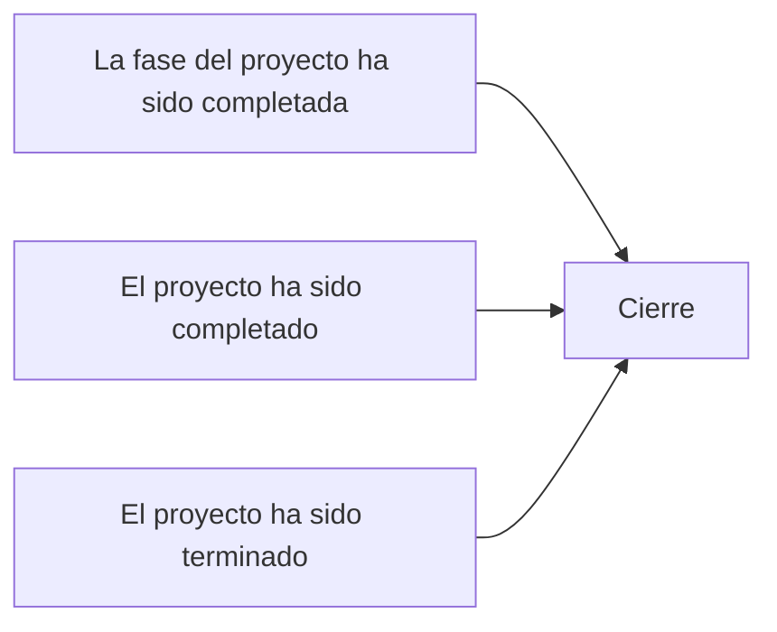

### Desgloce de Evaluación

Examen 70% project 30% teórico (50% global)
Matriz razi 5% (Todas las tareas minimo un rol R y todas A solo una vez)
Estudio de Factibilidad 10% (falto justificación)
Dimensionamiento 
Plan de comunicación 
Dos ejercicios de la ruta crítica 10% (5 por cada uno)
Practicas de Project 15%

# Entrega Final
- Portada
- Índice
- Introducción del proyecto (mínimo una cuartilla)
- Acta de inicio del proyecto (tentativamente pendiente)
- Caso de negocio
- Documento de planeación del proyecto (ya esta casí hecho, complementar los faltantes, descripcion del organigrama, misión visión, complementar análisis de factibilidad)
- Documento de lecciones aprendidas 
- Acta de cierre del proyecto
- Conclusiones (individuales)

#### Presentación final
No más de diez minutos para presentar el proyecto, con presentación ejecutiva, realizar publicidad del proyecto (realizar un video, comercial), entregar todo junto

**ENTREGA: Máximo 22 de Junio para entregar todo y las presentaciones son el día 25, el 24 es libre de no venir**

## Objetivos del modulo

Razones por las que se comienza el cierre:

### Cerrar las adquisiciones

Objetivo:
- Atar todos los cabos sueltos, verificando que todo el trabajo y los entrega bles sean aceptados, las reclamaciones abiertas finalizadas y las retenciones por cada adquisición en el proyecto pagadas
- Puede haber muchas adquisiciones en un proyecto, por lo que habrá muchos cierres de adquisiciones, pero sólo un cierre del proyecto.
- El cierre de las adquisiciones debe suceder antes del cierre del proyecto.
- Requiere más mantenimiento de registros y debe hacerse de manera más formal que la que generalmente se requiere para un cierre de proyecto, para asegurarte de proteger los intereses legales de ambas partes

Actividades del cierre de las adquisiciones
- **Verificación del producto.** Esto implica revisar para ver si todo el trabajo se concluyó de manera correcta y satisfactoria. 
- **Convenio negociado.** El convenio final de todas las reclamaciones facturas y otros asuntos puede ser manejado a través de negociaciones o a través del proceso de solución de conflictos previamente establecido en el contrato.
- **Cierre financiero.** En el cierre financiero se hacen pagos finales y se completan registros de costos.
- **Auditoria de las adquisiciones.** Esta es una revisión estructurada únicamente del proceso de las adquisiciones. Para obtener lecciones aprendidas del proceso de las adquisiciones que pueden ayudar a mejorar otras adquisiciones. Normalmente el gerente de adquisiciones y el director de proyectos lo realizan, pero las compañías que quieren mejorar sus procesos pueden también involucrar al proveedor.
- **Actualizaciones a los registros.**
- **presentación de cierre**
- **Lecciones aprendidas.**

#### Cerrar el producto o cierre de alguna fase

Finalizar todas las actividades en todos los grupos del proceso para cerrar formalmente el proyecto o la fase del proyecto. Se enfoca en el cierre de todas las áreas de conocimiento.

Implica dos procesos:
	- Procedimiento administrativo de cerrar el proyecto o la Fase
	- Procedimiento de cierre de contratos, solo si es necesario.

Estos procesos permiten validar y documentar entregables, formalizar su aceptación y documentar las acciones requeridas si el proyecto aún no se ha completado exitosamente.

Siempre cierras un proyecto, sin importar las circunstacias bajo las cuales e haya detenido, terminado o completado.
Involucra la aceptación formal del proyecto como un todo por parte del cliente, mientras que el proceso de verificar el alcance es evaluado en los entregables de cada fase

#### Procesos de cierre
Cierre administrativo:
	- Detalla todas las actividades, interacciones así como los roles y responsabilidades de los miembros del equipo y stakeholders involucrados en el proceso de cierre administrativo del proyecto.

Cierre de las adquisiciones
	- Implica todas las actividades e interacciones necesarias para resolver y cerrar todas las relaciones contractuales establecidas para el proyecto, así como definir las actividades de apoyo para el formal cierre administrativo del proyecto.

Procedimiento de cierre administrativo
- Confirmar que el trabajo es realizado de acuerdo con los requerimientos
- Completar el cierre de las adquisiciones.
- Obtener la aceptación fomal del producto.
- Completar el informe final del rendimiento
- Clasificar y archivar los registros.
- Actualizar la base de conocimientos de lecciones aprendidas.
- Entregar el producto completado.
- Liberar recursos.

**Todo lo que esta de amarillo hay que cambiarlo con nuestros datos, la fecha termina el 26 de junio  (fecha final del cronograma)**

