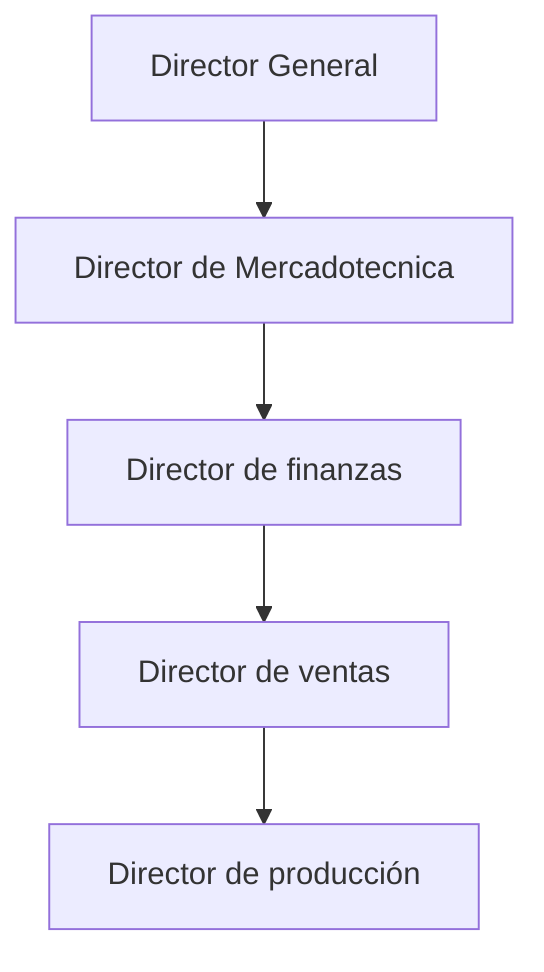

### Evaluación

Opción 1
50% --> Producto
30% --> sellos, tarea, apuntes, etc.
20% --> Actividad individual

Opción 2
50% --> Actividad con complejidad o no
50% --> Producto (trabajo en equipo)

Estructura orgánica de una organización, de manera jerárquica en el instituto, el director del Politécnico tiene distintos directores que se encargan de cada uno de las secretarias. Estas secretarias permean en la administración del Instituto, incluso hay direcciones de coordinación.

La parte administrativa hace una supervisión de los bienes de los recursos financieros, materiales o humanos, después se identifica como estos recursos van a funcionar.

El humano, quienes y a que hora van a dar clases o van a estar en las oficinas.
El financiero administra el recurso en distintas áreas que hay, se asigna un presupuesto a cada unidad académica, cada unidad tiene programado que va a gastar.

#### Diferencia entre director y líder
El ser un directivo no tiene que ser necesariamente un líder, es algo que se tiene que trabajar, tiene una serie de características. 

La alta dirección tiene que ver con la planificación a futuro de la empresa.

(PDI IPN 2024)

### LANIX

###### Misión:
Ser una empresa líder en creación de productos electrónicos y brindar a nuestros usuarios las ultimas innovaciones de la industria, así como productos que se ajusten a las diversas necesidades de los consumidores.

##### Visión:
Llegar a tener un impacto nacional y posicionarse como una referente en el mercado mundial, compitiendo con las grandes marcas internacionales.

¿Quienes somos?
Somos una empresa Mexicana dedicada al desarrollo de equipo de computo y tecnología móvil, que busca resaltar el producto mexicano como útil y capaz de competir con empresas internacionales que comercializan en México.

