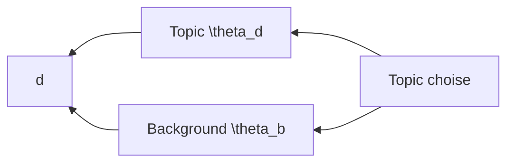
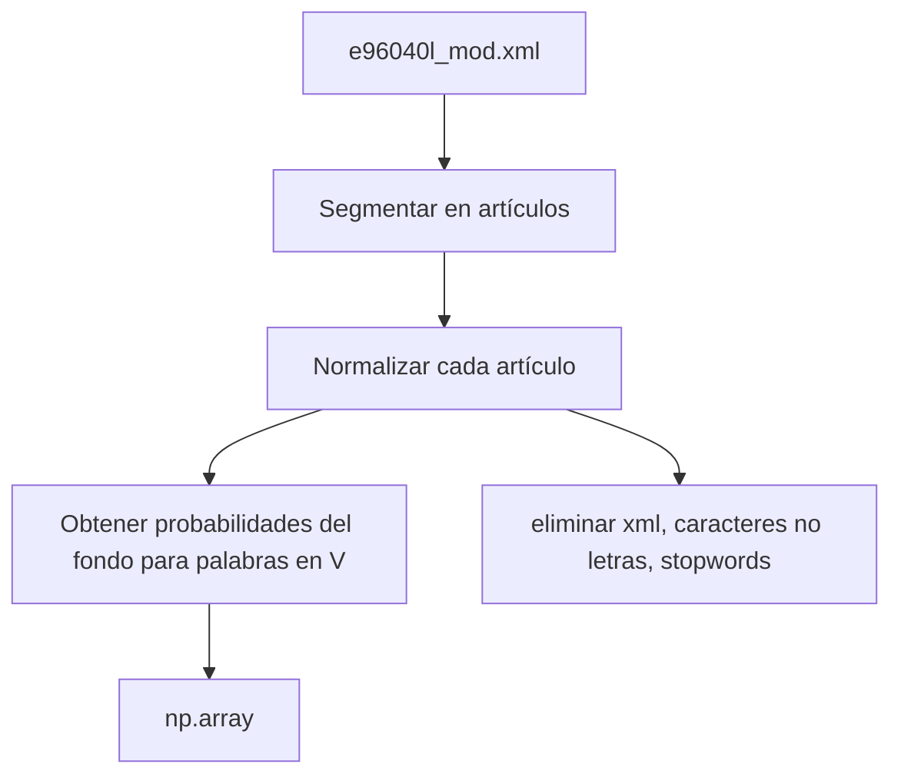
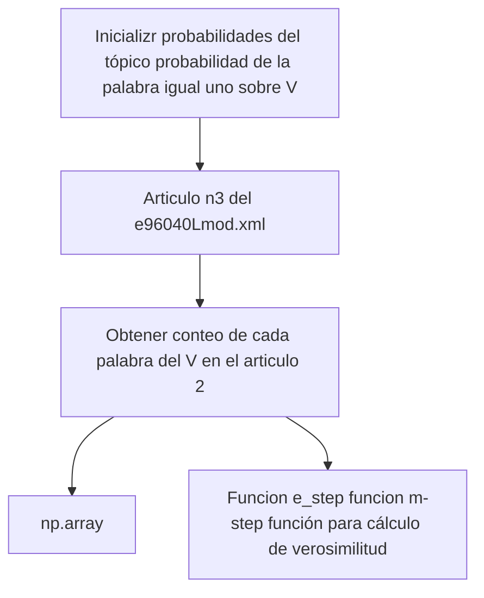

### Computation of Maximum likelihood estimate
Maximiza $p(d|\theta)$ : $(\theta_{1},\dots, \theta_{M}) = arg~max_{\theta_{1},\dots,\theta_{M}}~~p(d|\theta)=arg~max_{\theta_{1},\dots,\theta_{M}}~~\prod_{i=1}^{M} \theta_{i}^{c(w_{i},d)}$ 
Max. log-likelihood

$$p(w_{i}|\theta)=\frac{(w_{i},d)}{\sum_{i=1}^{M}(w_{i},d)}=\frac{c(w_{i},d)}{|d|}$$

#### What does the Topic look like?
d = text mining paper
can we get rid of these common words?

#### Generate d Using two word Distributions
d = text mining papel

where topic choise = $p(\theta_{d}) + p(\theta_{B})=1$ dado que $p(\theta_{d})=0.5$ y $p(\theta_{B})=0.5$ 

$$p(the)= p(\theta_{d})~~p(the|\theta_{d}) + p(\theta_{B})~~p(the|\theta_{B}) = 0.5*0.000001+0.5*0.03$$
$$p(tex)= p(\theta_{d})~~p(tex|\theta_{d}) + p(\theta_{B})~~p(the|\theta_{B}) = 0.5*0.04+0.5*0.04$$

Formally defines the following generative model:
$$w\rightarrow p(w)= p(\theta_{d})~~p(w|\theta_{d}) + p(\theta_{B})~~p(w|\theta_{B})$$
what if p = 1

#### Likelihood function:
$$p(d|\varLambda)=\prod_{i=1}^{|d|}p(x_{i}|\varLambda)=\prod_{i=1}^{|d|}[p(\theta_{d}) ~p(x_{i}|\theta_{d}) + p(\theta_{B})~p(x_{i}|\theta_{B})]$$
Ecuacion lineal:
$$0.5*p(text|\theta_{d})+0.5*0.1=0.5*p(the|\theta_{d})+0.5*0.9$$
quedando p(text|$\theta_{d}$) = 0.9 >> the = p(the|$\theta_{d}$) = 0.1

from $\theta_{d}~~(Z=0)$  $p(\theta_{d})~p(text|\theta_{d})$ 
para calcular si la palabra esta en $\theta_{d}$ o en $\theta_{B}$ usamos una variable Z
|$\theta_{d}$|$\theta_B$|
|--|--|
|$z=0$|$z=1$|

p(text|$\theta_d$)
p(text|$\theta_{B}$)

$$p(z=0|w=text ) = ~\frac{p(\theta_{d})~p(text|\theta_{d})}{p(\theta_{d})~p(text|\theta_{d})+p(\theta_{B}) p(text|\theta_{B})}$$

#### The expectation-Maximization (EM) Algoithm
$$p^{n}=\frac{p(\theta_{d}) p^{n}(w|\theta_{d})} {p(\theta_{d})p^{(n)} (w|\theta_{d}) +p(\theta_{B}) p(w|\theta_{B})} ~~\rightarrow E-step$$

how likely w is from $\theta_{d}$

$$p^{(n+1)} (w|\theta_{d})=\frac{c(w,d)p^{(n)} (z=0|w )}{\sum_{w' \in V} c(w',d)p^{(n)} (z=0|w' )}~~\rightarrow M-step$$

Assume $p(\theta_{d})=p(\theta_{B})= 0.5$ and $p(w|\theta_{B})$ is kwnown

| |conteos de palabrea de en articulo 2|probabilidad de palabras de fondo| Probabilidad de palabras del tópico|
|--|--|--|--|--|--|--|--|--|
|word|#|p(w$\mid \theta_B$)|Iteracion 1| | Iteracion 2| | Iteracion 3| |
| | | |P(w$\mid \theta$)| p(z=0$\mid$w)|p(w$\mid \theta$)|p(z=0$\mid$w)|p(w$\mid\theta$)|p(z=0$\mid$w)| 
|The|4|0.5|**0.25**|0.33|**0.20**|0.29|**0.18**|0.26|
|Paper| 2|0.3|**0.25**|0.45|**0.14**|0.32|**0.10**|0.25|
|Text| 4|0.1|**0.25**|0.71|**0.44**|0.81|**0.50**|0.93|
|Mining|2|0.1|**0.25**|0.71|**0.22**|0.69|**0.22**|0.69|
|Long-likelihood |||| -16.96||-16.13||-16.02|

17 de octubre del 2022

Funcion de verosimilitud: $log(p(articulo_{2}|modelo)) = \sum_{i=1}^{|V|}(conteo de w_{i}) + log(p(\theta_{B}) * p(W_{2}|\theta_{B}) +p(\theta_{d}) * p(w_{i}|\theta_{d}) ~~ \rightarrow algoritmo EM(tres funciones)$  Ordenar probabilidades del fondo y del topico e imprimir las primeras 10

Miercoles 23 de Noviembre 2022

#### Probabilistic Latents Semantic Analysis (PLSA)
formula: 
$(1-\lambda_{B}) p(\theta_{1})p(w\mid\theta_{1}) ~~ \rightarrow$ Topic $\theta_1$ = $p(\theta_1)=\pi_{d,1}$
+
$(1-\lambda_{B}) ~p(\theta_{2})~p(w\mid\theta_{2})~~\rightarrow$ Topic $\theta_{2}$ 
+
$(1-\lambda_{B}) ~p(\theta_{3})~p(w\mid\theta_{3})~~\rightarrow$ Topic $\theta_{3}$ 
+
$\lambda_{B}~p(w\mid\theta_{B})~~\rightarrow$ background

Formula:
$p_{d}(w)=\lambda_{B}~p(w\mid\theta_{B })+(q-\lambda_{B})\sum_{j=1}^{k} \pi_{d,j}p(w\mid\theta_{j})$ 
Verosimilitud de un documento $log~p(d) = \sum_{w \in V} c(w,d) log[\lambda_{B}p(w\mid\theta_{B})+(1-\lambda_{b}) \sum_{j=1}^{k} \pi_{d,j}p(w\mid\theta_{j})]$

#### Summary
- PLSA  = mixture model with k unigram LMs (k topics)

#### PLSA with prior knowledge
- Users may habe expectations about wich topics to analyze:
	- We expect to see "retrieval models" as a topic in IR 
	- We want to see aspects such as "batery" and "memory" for opinions 

Dirichlet distribution

Paqueteria a utilizar GENSIM
