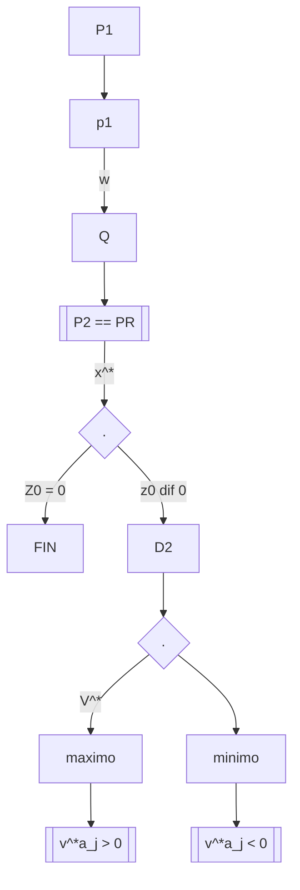

En esta sección describimos el método simplex dual, el cual reselve el problema dual directamente utilizando la tabla del método simple. En cada iteración nos movemos de una solución básica factible del poblema dual a una solución mejorada del problema dual hasta alcanzar la optimilidad del problema dual (y del problma primal también) o concluir que la solución del problema dual no es acotada y por lo tanto la región factible del problema primal vacia.

|Minimizar| $cx$|
|--|--|
|Sujeto a;| $A_{x}\geq b$|
| | $x\geq 0$ |

Sea B una vase que no es necesariamente factible y considere la siguiente tabla

|  |Z | $x_1$    $x_2$ $\dots\dots$ $x_{n}$| $x_{n+1} \dots \ x_{n+m}$|$C_{B}\overline{b}$|
|---|---|--|--|---|
| z| 1|$z_{1}-c_{1}$ $z_{2}-c_{2}\dots\ z_{n}-c_{n}$| $z_{n+1}-C_{n+1}\dots$ $z_{n+m}-c_{n+m}$| $\overline{b_1}$|
|$X_{b_1}$ | 0| $y_{11}\ Y_{12} \dots\ Y_{1n}$| $Y_{1,n+1} \dots\ Y_{i,n+m}$|  $\overline{b_{2}}$ |
|$\vdots$|$\vdots$|$\vdots$|$\vdots$|$\vdots$|
|$X_{B_{m}}$ | 0| $Y_{m1}\ Y_{m2}\dots\ Y_{mn}$ | $Y_{n,n+m}\dots\ Y_{n,n+m}$|$\overline{b_{n}}$ |

Si $\overline{b_{i}}\geq 0\ \forall i=1,2,\dots,m$ entonces $\overline{b} = B^{-1}b\geq 0$. Por tanto, la tabla permanece con solución óptima si $Z_{j}-C_{j}\leq 0\ \forall j= i,2,\dots,n+m$ 

26/10/2022
$a_{mi} = -e_{i}$
$C_{mi} = 0$ para $i=1,2,\dots, m$
luego
$Z_{m+i}- C_{m+i} = Wa_{mn}-C_{n+i} = W(-e_{i}) - 0 = -W_{i}$
Si además $Z_{mi}- C_{mi} \leq  0$ entonces $W_{i}\geq 0$ y así si esto sucede para $i=1,\dots m$ entonces $W\geq 0$. Es decir $Z_{j}-C_{j}\leq 0 \forall j=i,\dots n+m$ implica $wA\leq C$ y $W\geq 0$ donde $W=C_{B}B^{-1}$. En otrar poblem factibilidad dual es ecidente al criterio $Z_{j}-C_{j} \geq 0\ \forall\ j$. En el óptimo $W^{*} = C_{B}B^{-1} con W^{*}b =(C_{B} B^{-1})b = C_{B}(B^{-1}b) = C_{B}\overline{b} = Z^{*}$ 

#### Lemma 4 
En el óptimo C del problema pimal en su forma canonica, $Z_{j}-C_{j} \leq 0\ \forall j$ $W^{*} = C_{B}B^{-1}$ es ua solucion del problema dual. Además $W_{i}^{*} = -(Z_{n+i}-C_{n+i})\ \forall x=1,\dots, m$ 
Se tiene que pivotear

$$\frac{Z_{k} - C_{k}}{Y_{rk}} = minimizar \left\lbrace\frac{C_{j} - C_{j}}{Y_{rj}}\mid Y_{rj} \ \leq 0 \right\rbrace$$

### Inicialización
Encuentre una base B tal que $Z_{j}-C_{j} = C_{B}B^{-1}a_{j}-C_{j}\leq 0\ \forall\ j$ 
#### Paso principal
1) Si $\overline{b} = B^{-1}b \geq 0$ para la solución es óptima. En otro caso elija la fila lpunta r \tal que $\overline{b_{r}}=Minimizar \{\overline{b_{i}}\}$ 
2) Si $Y_{rj}\geq0\ \forall\ j$, poara el problema dual es no acotado y por tanto la región factible primal es vacia. En otro caso escoje K como $\frac{z_{k} - C_{k}}{Y_{rk}} = ~minimizar\left\lbrace \frac{Z_{j}-C_{j}}{Y_{rj}} \mid Y_{rj}\leq 0\right\rbrace$ 
3) Pivotee en $Y_{rk}$ y regrese al procedimiento 1) del paso principal.

## Ejemplo 6.6

|minimizar: |$2x_{1}+3x_{2}+4x_3$|
|--|--|
|Sujeto a;| $x_{1}+2x_{2}+x_{3}\geq3$|
| | $2x_{1}-x_{2}+3x_{3}\geq 4$|
| | $x_{1},x_{2}x_{3} \geq 0$|

#### IS 
1. Encuentra una base del problema primal tal que $Z_{j}- c_{j}=C_{B}B^{-1}a_{j}- c_{j} \leq 0$
#### Ms
1. Si $\overline{b}=B^{-1}b\leq0$ pare en caso dado elija $\overline{b_{v}} = mn{b_{i}}$ 
2. Si $y_{rj}\geq 0$ para, en otro caso k como  

Introducimos variables de olgura y obtenemos la base e identidad
$$x_{1}+2x_{2}+x_{3}-x_{4}+0x_{5}=3$$
$$2x_{1}-x_{2}+3x_{3}+0x_{4}-x_{5}=4$$
$$A=\begin{bmatrix}1 & 2 &1&-1&0 \\ 2&-1&3&0&-1\end{bmatrix}$$
y procedemos a multiplicar por menos uno para obtener la base
$$-(x_{1}+2x_{2}+x_{3}-x_{4}+0x_{5}=3)$$
$$-(2x_{1}-x_{2}+3x_{3}+0x_{4}-x_{5}=4()$$$$A=\begin{bmatrix}-1&-2&-1&1&0 \\ -2&1&-3&0&1\end{bmatrix}~~identidad=\begin{bmatrix}-3 \\ -4\end{bmatrix}$$

## Ejemplo G.7         03/11/2022 

|Minimizar| $3x_{1}+4x_{2}+6x_{3}+7x_{4}+x_{5}$|
|--|--|
| sujeto a; | $2x_{1}- x_{2}+x_{3}+6x_{4}-5x_{5}-x_{6}=6$|
| | $x_{1}+x_{2}+2x_{3}+x_{4}+2x_{5}-x_{7}=3$|
| | $x_{1},x_{2},x_{3},x_{4},x_{5},x_{6},x_{7}\geq 0$|

|Maximizar|$6w_{1}+3w_2$|
|--|-|
|Sujeto a;| $2w_{1}+w_{2}\leq 3$|
| |$-w_{1}+w_{2}\leq 4$|
| | $w_{1}+2w_{2}\leq 6$|
| | $6w_{1}+w_{2}\leq 7$|
| |$-5w_{1}+2w_{2}\leq 7$ |
| |$-w_{1},-w_{2}\leq 0$ |

$w_{1},w_{2}$ sin vertacion
tenemos que poner variables para balancear a las demas $$a = \sum b_{2}+3$$
se agregan variables:
$$x_{6},x_{7},x_{8},x_{9}$$ pasaria con las variables artificiales a:

|minimizar | $\epsilon ~~0x_{j}+1x_{9}~~j\in R$  |
|--|--|
| sujeto a;| $\sum a_{j}x_{j}+x_{9}=b ~~ j \in Q$
| |$x_{j}\leq 0~\forall~j\in q~ x_{9}\leq 0$ |
$$\begin{bmatrix}-1\\0\end{bmatrix}x_{0}+ \begin{bmatrix}0\\1\end{bmatrix}x_{7}+ \left(\begin{matrix}x_{8}\\x_{9} \end{matrix}\right) = \begin{pmatrix}6\\3\end{pmatrix}$$

Con el problema dual se da una solucion factible de arranque y eso me sirve para obtener el conjunto "Q", buscamos en donde las desigualdades se vuelven igualdades, con el conjunto Q obtenemos el problema primal restrignido, después lo resolvemos, despues obtenemos una evaluación en la función objetivo si esa evaluación es cero ya se termino, si no se calcula al problema dual restringido su dual, de:

|Mnimizar|$x_{8}+x_{9}= 9=x_{9}$|
|--|--|
|Sujeto a;| ($x_{3}$)|
| | $-x_{6}+x_{8}= 6$|
| | $-x_{7}+x_{9}=3$|
| |$x_{6},x_{7},x_{8},x_{9}\geq0$|

con esto obtenemos la matriz, del primer problema dual:

$$A=\begin{bmatrix}2 & -1& 1&6&5&-1&0\\1&1&2&1&2&0&-1\end{bmatrix}$$
$$A=\begin{bmatrix}-1 & 0&1&0\\0 & -1&0&1\end{bmatrix}$$
con los siguientes vectores b y c:
$$C = (0,0,1,1), ~~ b=\begin{pmatrix}6\\3\end{pmatrix}$$

|minimizar | $N^{T}b$|
|--|--|
|sujeto a;|$NA\leq C$|

Visto de otra forma la restriccion sería:
N de tamaño (1x2)
A de tamaño (2x4)
C de tamaño (1x4)
$$(-V_{1}-V_{2},V_{1},V_{2}) = (V_{1},V_{2}) \begin{bmatrix}-1&0&1&0\\0&-1&0&1\end{bmatrix}\leq [0,0,1,1]$$
Ahora hay que resolver estre problema
Las restricciones serían:
Minimizar : $6V_{1}+3V_{2}$
Sujeto a;
$-N_{1}\leq0$
$-N_{2}\leq0$
$N_{1}\leq1$
$N_{2}\leq1$
con lo que $V_{1} ~ y ~ V_{2}$ solo pueden tomar valores entre 0 y 1 por lo que asumimos lo siguiente:
$$(V_{1},V_{2}) = (1,1)$$
ahora vamos a caulcular un teta donde $V^{*}$ va a ser la solucion que acabamos de asumir
$$w=(0,0) \iff 2 + \sigma V^{*}$$
para calcular al teta tenemos la siguiente formula:
$$\sigma = minimizar ~~j \left\lbrace -\frac{(W_{aj} - (j))}{V^{*}a_{j}}\mid \underline{V^{*}a_{j}> 0}\right\rbrace$$
$$minimizar~j\in\{3,4\}~\left\lbrace \frac{3}{3},~,\frac{6}{3}, \frac{7}{7},~,~,~, \right\rbrace=1 $$
$$C=(3,4,6,7,1,0,0)$$
$$W=(0,0) + 1 (1,1) = (1,1)$$
Lo que sigue después de esto es volver a hacerlo pero sin el (0,0)
primer problema 

|Maximizar|$6w_{1}+3w_2$||
|--|-|-|
|Sujeto a;| $2w_{1}+w_{2}\leq 3$|si|
| |$-w_{1}+w_{2}\leq 4$|no|
| | $w_{1}+2w_{2}\leq 6$|no|
| | $6w_{1}+w_{2}\leq 7$|si|
| |$-5w_{1}+2w_{2}\leq 7$ |no|
| |$-w_{1},-w_{2}\leq 0$ |no|

$W_{1}$ y $W_{2}$ sin restricción, volvemos a iniciar el proceso en vez de (0,0) con (1,1) y empezamos obteniendo igualdades evualando (1,1) en cada restriccion, esto nos sirve para la Q que es $Q=\{1, 4\}$ y con esto obtenemos las variables artificiales para crear el problema dual restricctivo, el cual es:

|Minimizar|$1x_4$|
|-|-|
|Sujeto a;|$\sum\limits x_{j}+a_{j}+ x_{4}= b~~ j\in Q$| 

con los valores:
$$b=\begin{pmatrix}6\\3\end{pmatrix} \iff ~ \begin{pmatrix}2\\1\end{pmatrix}x_{1}+x_{4}\begin{pmatrix}6\\1\end{pmatrix} + \begin{pmatrix}x_{8}\\x_{9}\end{pmatrix} = \begin{pmatrix}6\\3\end{pmatrix}$$
Tenemos que meter n variables artificiales que sean iguales a las n variables problematicas.
Como podemos obtener las variables problematicas

Minimizar : $x_{8}+x_{9}$
Sujeto a;
$2x_{1}+6x_{4} + x_{8}= 6$
$2x_{1}+6x_{4}+x_{9}=3$
$x_{1},x_{4},x_{8},x_{9}\geq 0$ 

Mientras $x_{8}$ y $x_{9}$ sean más pequeños más facil de resolver, tomando a $x_{8}$ y $x_{9}$ = 0 tenemos que nuestro sistema queda igual a:

$2x_{1}+6x_{4}=6$
$x_{1}+x_{4}=3$
quedando nuestra solucion como: 
$x_{4}=0$ y $x_{1}=3$
La solucion seria: $(3,0,0,0)$ y al evaluarlo nos da cero, por lo que ya tendríamos optimizado el problema dual restringido, mientras que la solución del primer problema la solucion sería la misma solo acompletando las variables que falta con ceros, quitando las variables artificiales $(3,0,0,0,0,0,0)$ 

y al terminar estre proceso es una primera iteración.

[[Matematicas avanzadas]]
