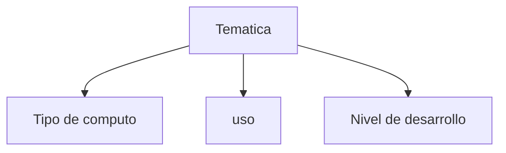
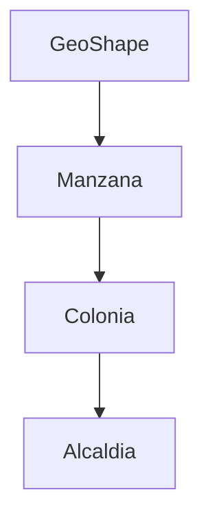

```mermaid
flowchart TD
Temática[Tematica] --> id1["Tipo de computo"]
Temática --> uso
Temática --> id2["Nivel de desarrollo"]
```
1) Objetivo $\rightarrow$ Descubrir las tendencias y patrones de consumo  anivel manzana
2) Modelo de DM:
	1) Tendencia
	2) Predecir

```mermaid
flowchart TD
GeoShape --> Manzana --> Colonia --> Alcaldia
```
