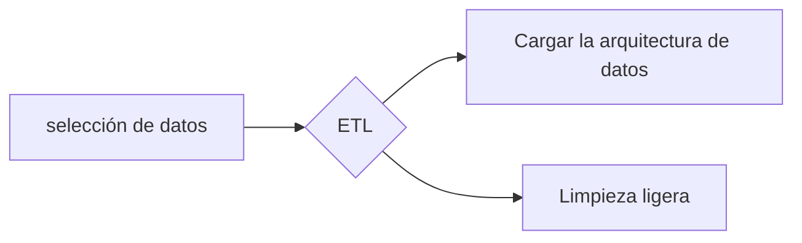
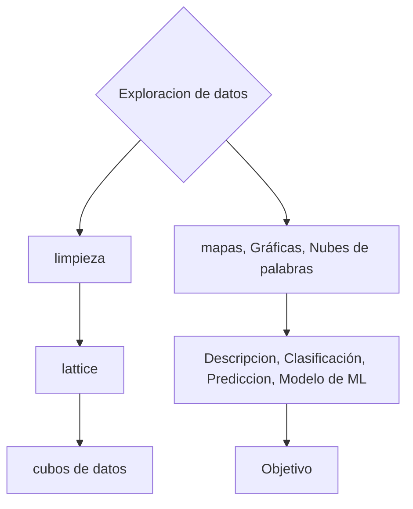

1. Título
2. Objetivo
	1. Lo que quiero resolver
3. Planteamiento del problema
	1. Reto técnico
4. Descripción de las fuentes de los datos
	1. Practica 2
5. Arquitectura de datos
	1. Modelo tentativo
		1. Constelacion
		2. Copo de nieve
		3. Estrella
6. Fases de procesamiento de datos

Noviembre

Diciembre

7. Plan de trabajo
