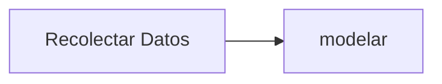

Ciclo de diseño

Tipos de aprendizaje
Aprendizaje supervizado
- Se proporciona un conjunto de datos, usado para

Aprendizaje no supervizado
- no tiene clases especificadas
- o clustering, no existe un experto

### Aprendizaje por reforzamiento
El objetivo es encontrar acciones adeuadas

## Factor de Olvido (Resubstitution Error)
- No es propiamente un método de vaildación
- Es el error en el conjutnto de entrenamiento
- Generalmente no es cero

# Método de validación
1. Dividir el banco de datos en lo subconjuntos de entrenamiento (E) y prueba (P), de la siguiente forma
2. Seleccionar aleatoriamente |E| patrones del banco de datos para crear el conjunto de entrenamiento
3. Seleccionar aleatoriamente |P| patrones del banco de datos para crear el conjunto de prueba
4. Entrenar el algorimo con E y probar con P

### Hold-out estratificado
Ejemplo con la irisplant y $r=0.7$
