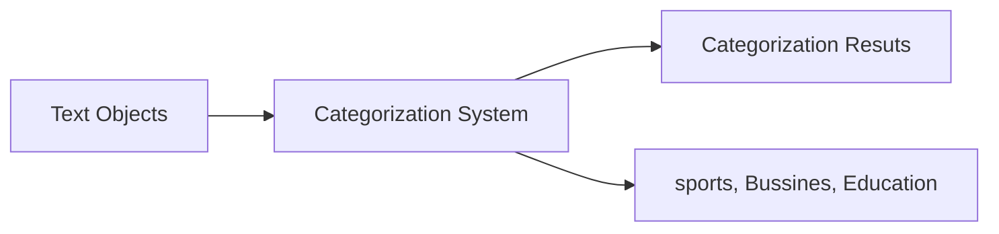
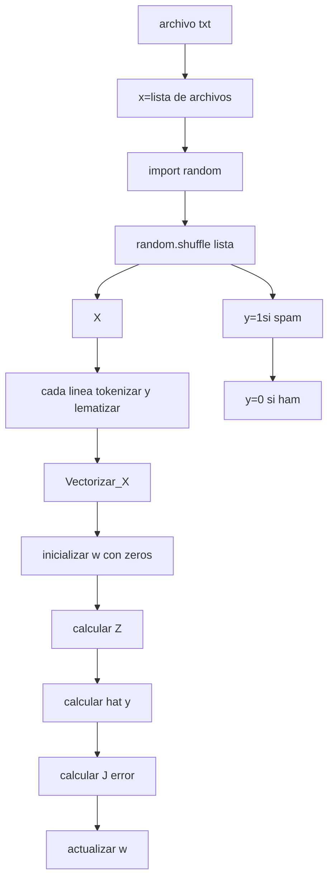

### Text cateorization
Given the following: 
- A set of **predefined categories.** possibly forming a hierarchy and often
- A **training set** of labeled text objects
Task: **Classify** a text object into **one or more** of the **categories**


A partir de los tópicos se clasifican los textos, los tópicos ahora son categorias.

#### Examples of TExt CAtegorization
- Text objects can vary (e.g., documents, passages, or collections of text)
- Categories can also vary
	- **"Internal"** categories that characterize a text object (e.g., topical categories, sentiment categories)
	- **"External"** categories that characterize an entity associated with the text object (e.g., author attribution or any other meaningful categories associated with text data)
- Some **examples of applications**
	- News categorization, literature article categorization (e.g., MeSH annotations)
	- Spam email detection/filtering
	- Sentiment categorizatos of product review

#### Variants of problem formulation
- Binary categorization: Only two categories
	- Retrieval: {relevant-doc, non-relevant-doc}
	- Spam filtering: {spam, non-spam}
	- Opinion: {positive, negativa}
- **K-category** categorization: More than two categories
	- Topic categorization: {sports, science, trable, business,$\dots$}
	- Email routing: {folder1, folder2, folder3,$\dots$}

#### Why text categorization?
- To **enrich text representation** (more understandig of text)
	- Text can now be represented in multiple levels (keywords + categories)
	- Semantic categories assingned can be directly or indirectly useful for an application
	- Semantic categories facilitate aggregation of text content (e.g., aggregating all positive/negative opinions about a product)
- To **infer properties of entities** associated with text data

#### Categorization Methods: Automatic
Use **huma experts** to:
- Annotate data sets with **category laabels** $\rightarrow$ training data
- Provide a ser of **features** to represent each text object that can potentially provide a "clue" about the category
Use **machine learning** to learn "soft rules" for categorization from the training data
- Figure out **wich features are most useful** for separating different categories
- **Optimally combine the features** to **minimize the errors** of categorization on the training data
- The trained classifier can then be applied to a new text object to predict the most likely category (that a human expert would assing to it)

#### Machine Learning for Text CAtegorization
**General setup:** Learn a classifier $f:X\rightarrow Y$ 
- Input: X = all text objects; Output Y = alll categories

Naive Bayes Classifier
$$category(d) = arg~max_{i}~log~p(\theta_{i}) + \sum\limits_{w\in V} c(w,d)log~p(w\mid\theta_{i})$$

wich category is most popular?
$$p(\theta_{i} )=\frac{N_{i}}{\sum\limits_{j=1}^{k}N_{j}}\infty\mid T_{i} \mid$$

wich word is most frequent in category?
$$p(w\mid\theta_{i}) = \frac{\sum\limits_{j=1}^{N_{i}} c(w,d_{ij})} {\sum\limits_{w' \in V}\sum\limits_{j=1}^{N_{i}}c(w',d_{ij})+\mu} $$

how?
$$p(\theta_{i})=\frac{N_{i}+\delta }{\sum\limits_{j=1}^{k} N_{j}+k~\delta} ~~\delta\geq0$$

Score:
$$score(d) =log\frac{p(\theta_{1}\mid d)}{p(\theta_{2}\mid d)} = log\frac{p(\theta_{1} \prod_{w~\in V} p(w\mid\theta_{1})^{c(w,d)} )}{p(\theta_{2}) \prod_{w~\in~V} p(w\mid\theta_{2})^{c(w,d)}} = log\frac{p(\theta_{1})}{p(\theta_{2})} + \sum\limits_{w~\in~V} c(w,d)log\frac{p(w\mid\theta_{1})}{p(w\mid\theta_{2})}$$

<div align='right'><h3>30/11/2022</h3></div>
Usamos la formula:
$$p(k)=\begin{pmatrix}n\\k\end{pmatrix}~~p^{k}(1-p)^{n-k}$$
si no se usa, para calcular el valor de la probabilidad usamos:
$$f(p) = p^{k}(1-p)^n-k$$
$$f(\theta) = \theta^{k}(1-0)^{n-k}$$
Queremos encontrar tal valor de $\theta$ que máximice la función, entonces usamos:
$$\hat{\theta} = argmax~\theta^{k}(1-\theta)^{n-k}$$
usamos $x,y$ solo necesitamos darle una probabilidad. Lo que se busca es calcular la probabilidad de y que más se acerque a 1. ($1\leftarrow y \rightarrow 0$). 
$$\hat{y} = argmax~\hat{y}^{y}(1-\hat{y})^{1-y}$$
Esta es la función de verosimilitd para un soo ejemplo, para ver la verosimilitud de todas tenemos que multiplicar las probabilidades, como es muy difíicil trabajar con ella se usa el logaritmo.
$p=\epsilon^\alpha/1+\epsilon^{\alpha}$  regresión logistica

Teniendo los textos como vectores. SE usa el algotimo de decenso gradiente

<div align = 'right'><h3>01/12/2022</h3></div>
Tenemos: texto =$(x_{1},x_{2},\dots,x_{n})$ de clase 1; y=1 o de clase 0 :y=0
Objetivo: a partir de $(x_{1}, x_{2},\dots,x_{n})$ calcular $p(y=1)$ de tal manera ue $p~(y=1)$ sea cerca a 1.
Notacion: $p~(y=1 )=p$
Es dificil calcular p a partir de $(x_{1},x_{2},\dots,x_{n})$ directamente, por eso se aplica una trasformación a p:
$$p\rightarrow \frac{p}{1-p} \rightarrow log~\left(\frac{p}{1-p}\right) \rightarrow se~llama~logit$$
muchas vces se representa por la letra $Z$ 
Esta representada de la siguiente manera:
$$logit=Z=w_{0}x_{x}+w_{1}x_{1}+w_{2}x_{2}+\dots+w_{n}x_{n}$$
$$log\frac{p}{1-p} = Z$$
$$exp\left(log\frac{p}{1-p}\right)= exp(Z)$$
$$p=\frac{exp(Z)}{exp(Z)+1} = \sigma(Z)=\hat{y} \rightarrow sigmoide$$
$$verosimilitud=\hat{y} (1-\hat{y})\rightarrow log(verosimilitud) = y~log(\hat{y})+(1-y)log(1-\hat{y})$$
$$f~de~costo(error) =J(\vec{w})=-\frac{1}{m}\sum_{i=1}^{m}y~log(\hat{y})+(1-y)~log(1-\hat{y})$$
$$\frac{\partial J}{\partial~w_{j}}=\frac{1}{m}\sum_{i=1}^{m}(\hat{y}-y)(x_{j})$$
$$Actualizar~pesos=W_{j} := w_{j}-\alpha*\frac{\partial J}{\partial~w_{j}}$$




Realizar 1000 iteraciones desde calcular z hasta el final con valor $\alpha=10.5$ 

```phyton 3
# Tokenizar y lematizar
wnl = nltk.WordNetLemmatizer()
wnl.lemmatize(token)

# Calculo de Z
Z = np.dot(w.T, X)

# Calculo de hat y
sigma(z)
```

<div align='right'><h4>05/12/2022</h4></div>
#### Estimation of parameters
Training data: T={($x_{i},y_{i}$)},$i=1,2,\dots,\mid T\mid$ 
Parameters: $\vec{\beta}=(\beta_{0},\beta_{1},\dots,\beta_{M})$  
Conditional likelihood: $p(T\mid\vec{\beta}) = \prod_{i=1}^{\mid T\mid} p(Y_{i}\mid X ) X_{i},\vec{\beta}$ 
$y_{i}= 1:~~p(Y=1\mid X )=\frac{e^{\beta_{0}}+\sum\limits_{i=1}^{M}x_{i}\beta_{i}}{e^{\beta_{0}}+\sum\limits_{i=1}^{M}x_{i}\beta_{i}+1}$ , $y_{i}=0:~~\frac{1}{e^{\beta}}$ 

#### Discriminative Classifier 2: k_Nearset Neighbors (K-NN)
- Find k examples in the trainig set that are most similar to the text object to be classified ('neighbor' documents)
- Assign the category that is most common in these neighbor text objects (neighbors vote for the category)
- Can be improved by considering the distance of a neighbor (a closer neighbor has more influece)
- Can be regarded as a way to directly estimate the conditional probability of label given data instance, i-e., p(Y|X)
- Need a similarity function to measure similarity of tow text objects


<div align='right'><h5>07/12/2022</h5></div>
1. ¿Cuáles palabras?
2. Vectores gigantes: space vectors $[0, 0, 0, \dots, 1, \dots, \dots, 0]$ index = 10273 (10273, 1)
3. Reducción de dimensionalidad
| PCA | SVD | DNN|
|--|--|--|
|Entrada $[1P36024, 15682]$ | $\rightarrow$ |$p(y\mid x) clase0$ y clase 1|

$Classification~Acurracy = \frac{Total~number~of~correct~decisions}{Total~number~of~decisions~made}$

$=count(y(+))+count(n(-)) / KN$

Precision$= \frac{TP}{TP+FP}$ 

Recall = $\frac{TP}{TP+FN}$

| |System ("y")|System("n")|
|--|--|--|
|Human (+)|TP|FN|
|Human (-)|FP|TN|

Precision ham = $\frac{TN}{TN+FN}$
Recall = $\frac{TN}{TN+FP}$


[[Procesamiento de Lenguaje Natural]] 