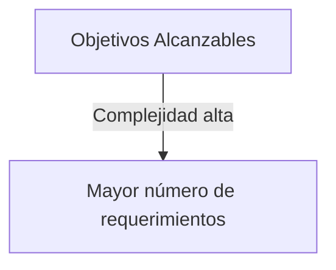

Las preguntas que debemos hacernos para ver si hay áreas de oportunidad
- ¿Cuánto mejoraría tu proyecto más reciente si pudieras mágicamente hacerlo todo de nuevo?
- La planeación del proyecto determina si los objetivos definidos en el acta de constitución son alcanzables, así como la manera en que se logrará el proyecto.
- Determinar cuales procesos del PMBOK resultan adecuados para las encesidades del proyecto.
- Los resultados de la planeación son un plan para la dirección del proyecto y los documentos del proyecto.

La complejidad nos va a dar el dimensionamiento del proyecto (Tamaño)

#### Desarollar el plan para la dirección del proyecto
Adaptación
- Es el proceso de selección de los procesos del PMBOK, su grado de detalle y documentos a utilizar, para generar la metodología de Dirección del proyecto que vamos a planear.
- Esta adapatación es realizada por el project Manager en conjunto con el project team y avalado por el Sponsor

Sistema de Administración de la configuración
- Es la colección de procedimientos formales documentados, que permiten identificar las características técnicas y funiconales de un producto, resultado, servicio o componente.
- Controla cualquier cambio a esas características registrando y reportando dicho cambio así como el estado de su implementación
- Define la auditoría a los productos, resultados o componentes para verificar su conformidad con los requerimientos.
- Incluye documentación, sistemas de rastreo, y niveles de aprobación definidos necesarios para autorizar y controlar los cambios.
- Incluye las líneas base (baseline) del Alanace, Tiempo, Costo, y Calidad. Define elementos de configuración. (triangulo de proyecto)

##### Linea Base de Rendimiento

| Alance                | Tiempo                                 | Costo                  |
| --------------------- | -------------------------------------- | ---------------------- |
| Enunciado del alcance | Cronograma (con todas las actividades) | Cronograma             |
| WBS (EDT)             |                                        | Costos del Proyecto    |
| Diccionario de la WBS |                                        | Costos de contigencias |

También hay que considerar lo que esta fuera del alcance

**Diccionario EDT**

 ##### Cronograma
 - Asignar responsables
 - Fechas
 - Tiempo
 - Matriz de Raci
 - Roles y responsabilidades

- Proyecto Exitoso
	- Un proyecto es exitoso cuando se concluye dentro de las restricciones de tiempo, costo y alacne
- Además de:
	- Estar alineado con la estrategia de negocio
	- Con el nivel de desempeño apropiado
	- Sin alterar el flujo de trabajo normal de la organización.
	- Con cambios mínimos o mutuamente acordados.
	- **Aceptado por el cliente**
	- **Sin afectar negativamente a la organización**

